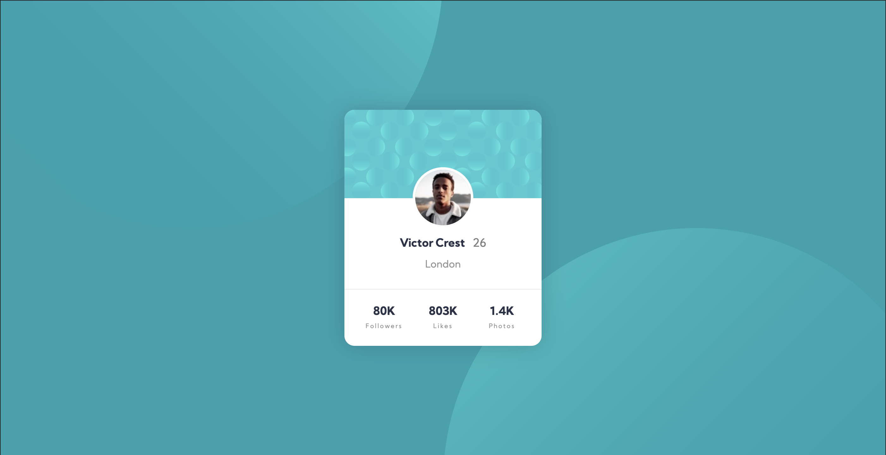

# Frontend Mentor - Profile card component solution

This is a solution to the [Profile card component challenge on Frontend Mentor](https://www.frontendmentor.io/challenges/profile-card-component-cfArpWshJ). Frontend Mentor challenges help you improve your coding skills by building realistic projects.

## Table of contents

- [Overview](#overview)
  - [The challenge](#the-challenge)
  - [Screenshot](#screenshot)
  - [Links](#links)
- [My process](#my-process)
  - [Built with](#built-with)
  - [Continued development](#continued-development)
- [Author](#author)

## Overview

### The challenge

- Build out the project to the designs provided

### Screenshot

### Links

- Solution URL: [https://github.com/dentednerd/fm-profile-card](https://github.com/dentednerd/fm-profile-card)
- Live Site URL: [https://dn-fm-profile-card.netlify.app/](https://dn-fm-profile-card.netlify.app/)

## My process

### Built with

- Semantic HTML5 markup
- CSS custom properties
- Flexbox
- CSS Grid
- Mobile-first workflow
- [React](https://reactjs.org/)
- [Styled Components](https://styled-components.com/)

### What I learned

React is *massive overkill* for this project, but I had my reasons for using it. Sass would have been cleaner.

Getting the background circles to be correctly responsive was a huge pain, but in the end it was as simple as keeping the image sizes static at 800px each. That'll teach me to overthink things.

### Continued development

Why did I use React for such a simple project? It's part of a bigger future project.

## Author

- Website - [Joey Imlay](https://joeyimlay.dev)
- Frontend Mentor - [@dentednerd](https://www.frontendmentor.io/profile/dentednerd)
- Twitter - [@dentednerd](https://www.twitter.com/dentednerd)
